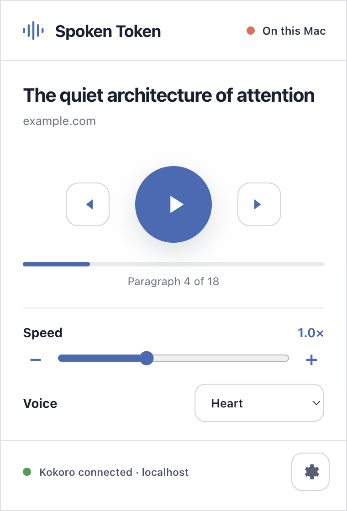

# Spoken Token

Spoken Token is a private Chromium extension that reads webpages aloud with a
speech engine running entirely on your Mac.



## Why Spoken Token

- **Local by design:** readable page text is sent only to a loopback address on
  your computer.
- **No account or API key:** the included macOS speech engine works without a
  cloud service, subscription, or developer credential.
- **Minimal browser access:** the extension receives access to the current page
  only after you click it.
- **Comfortable listening:** play, pause, move between paragraphs, adjust speed,
  and choose a voice from the popup.
- **Selection-aware:** select text before opening Spoken Token to read only that
  selection.

## Quick start on macOS

### 1. Start the local speech engine

Double-click **Start Spoken Token.command**. A Terminal window stays open while
the speech engine is available. Close it or press Control-C to stop.

You can also start it from this project directory:

```sh
python3 local_server.py
```

The included server uses voices already installed in macOS. It requires no
Python packages, account, API key, Docker container, or internet connection.

### 2. Load the extension

1. Open `chrome://extensions` in Chrome, Edge, or Brave.
2. Turn on **Developer mode**.
3. Choose **Load unpacked**.
4. Select this project's `extension` directory.
5. Pin **Spoken Token** to the toolbar if you want one-click access.

The extension remains locally installed in that browser profile. It is not
submitted to or distributed through a browser extension store.

### 3. Read a webpage

1. Open an article or another text-heavy page.
2. Click **Spoken Token**.
3. Press the large play button.
4. Pause, move between paragraphs, change the reading speed, or choose a voice.

If text is selected, Spoken Token reads the selection. Otherwise it prefers the
page's article or main content and removes navigation, dialogs, forms, scripts,
and other page chrome.

## Optional Kokoro neural voice

The zero-download macOS engine is the default. For a neural voice, the included
Docker configuration runs Kokoro locally:

```sh
docker compose up -d
```

The first start downloads a large Kokoro model image. The service is published
only on `127.0.0.1:8880`, so other computers on your network cannot reach it.
Stop the macOS speech server first because both engines use the same port.

Stop Kokoro with:

```sh
docker compose down
```

## Privacy and security

Spoken Token is intentionally credential-free:

- no API keys, access tokens, passwords, cookies, or cloud credentials;
- no analytics, telemetry, advertising, or remote logging;
- no browsing-history, identity, clipboard, microphone, or camera permission;
- no automatic access to every website;
- network permission limited to `http://localhost/*` and
  `http://127.0.0.1/*`;
- settings reject speech endpoints that are not loopback addresses;
- the included speech servers bind only to `127.0.0.1`.

The extension stores only local preferences such as voice, speed, endpoint, and
chunk length. See [PRIVACY.md](PRIVACY.md) and [SECURITY.md](SECURITY.md) for the
complete data-flow and security notes.

## Compatibility and limitations

Spoken Token targets Manifest V3 Chromium browsers with the Offscreen API:
Chrome 109+, current Edge, and current Brave.

Browser-internal pages, extension stores, and some built-in PDF views do not
allow content extraction. The included zero-dependency speech server is
macOS-only; other operating systems can use a loopback OpenAI-compatible speech
endpoint such as Kokoro.

Both included speech options use:

```text
http://127.0.0.1:8880/v1/audio/speech
```

## Development

No package installation is required:

```sh
npm run check
npm test
```

Project layout:

- `extension/` — load-unpacked browser extension
- `design/popup-implementation.png` — current popup preview
- `tests/` — manifest, privacy, parsing, and structure checks
- `local_server.py` — zero-dependency bridge to installed macOS voices
- `Start Spoken Token.command` — double-click launcher
- `docker-compose.yml` — optional loopback-only Kokoro service
